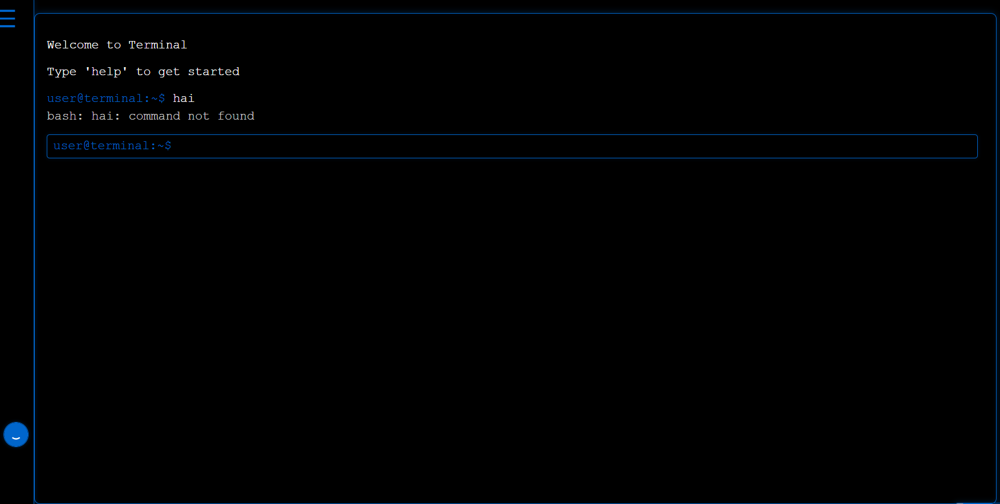

# Terminal Replica (Minimal Blue Theme)

A minimalist web-based terminal interface with a glowing blue border aesthetic. Simulates basic terminal commands and interaction, built entirely with HTML, CSS, and JavaScript.

## 📸 Preview

## 🔧 Features

- Terminal-style UI with blue neon borders
- Responsive design with side navigation
- Simulated commands: `help`, `clear`, `about`, `contact`, `ls`
- Typing and output experience similar to a command-line terminal

## 🚀 Usage

Simply open the `index.html` file in a browser to get started.

## 🛠 Commands

| Command  | Description                                |
|----------|--------------------------------------------|
| help     | Lists available commands                   |
| clear    | Clears the terminal screen                 |
| about    | Shows a short description                  |
| contact  | Displays a sample contact email            |
| ls       | Lists mock directory items                 |

## 📸 Preview

 <!-- Add screenshot image if available -->

## 📁 Project Structure

.
├── index.html
├── img/
│ └── favicon.png

